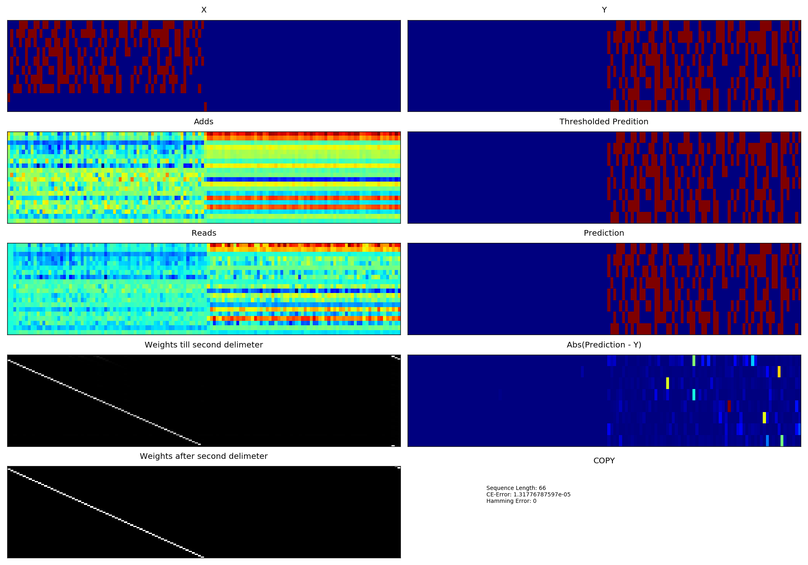

# Neural-Turing-Machines
An attempt at replicating Deepmind's Neural Turing Machines in Theano.

Here is the link to the paper: http://arxiv.org/abs/1410.5401

## Results
- Currently, only COPY task is implemented.
- Training is done on sequences of length varying from 1 to 20 and width 8.
- It takes ~200k iterations (training samples) to get a well trained model.
- The model is able to nicely generalize on sequences of length above 100 with zero hamming error.
- Have a look at `plots` directory.
- Following figure shows the generalization on a test sequence of length 66.



## Usage
For training: In ntm.py set
```
to_test = False
```
To run your trained model or a pre-trained model from `model` directory,

In ntm.py set
```
to_test = True
test_path = path_to_npz_model_parameters_file
```

## Other NTM Implementations
- fumin very nicely explained NTM with a working implementation in GO. Check out: https://github.com/fumin/ntm
- Another NTM implementation in Theano by shawntawn. Check out: https://github.com/shawntan/neural-turing-machines

## Future works
- Making NTM to work on other tasks described in the paper.
- Using NTM for Machine Translation.